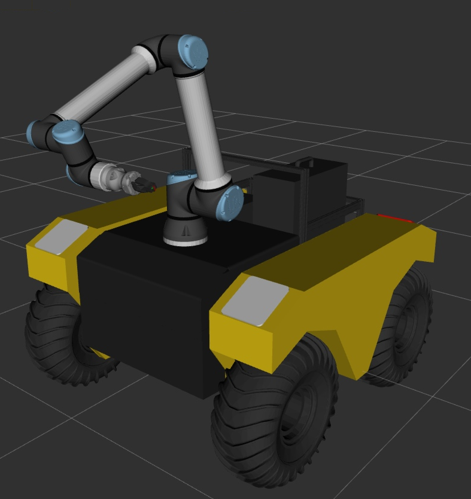

# WilbUR

Description, deployments, tooling, and configuration files for the WilbUR robot mobile manipulation platform.
WilbUR is part of Johnson Space Center's [iMETRO](https://github.com/NASA-JSC-Robotics/iMETRO) facility.
The robot consists of,

* A UR10e serial manipulator with Robotiq Hand-E Gripper
* A Clearpath Warthog mobile base

Additional sensors (such as cameras, lidar, etc) are a work in progress.



## Usage

This project is under active development.
For now, description files and a basic Gazebo simulation are included.

To launch the gazebo simulation:

Now supporting Wilbur and Pumbaa

For Wilbur

```bash
# Launch the Warthog only
ros2 launch wilbur_gz sim_gz.launch.py include_ur:=false

# Launch the Warthog and attached UR10e + Gripper
ros2 launch wilbur_gz sim_gz.launch.py
```

For Pumbaa
> **_NOTE:_**  Pumbaa's configuration doesn not have UR arm..

```bash
# Launch the Pumbaa
ros2 launch wilbur_gz pumbaa_sim_gz.launch.py
```

## Citation

This project falls under the purview of the iMETRO project.
If you use this in your own work, please cite the following paper:

```bibtex
@INPROCEEDINGS{imetro-facility-2025,
  author={Dunkelberger, Nathan and Sheetz, Emily and Rainen, Connor and Graf, Jodi and Hart, Nikki and Zemler, Emma and Azimi, Shaun},
  booktitle={2025 22nd International Conference on Ubiquitous Robots (UR)},
  title={Design of the iMETRO Facility: A Platform for Intravehicular Space Robotics Research},
  year={2025},
  volume={},
  number={},
  pages={390-397},
  keywords={NASA;Moon;Seals;Maintenance engineering;Maintenance;Robots;Standards;Open source software;Testing;Logistics},
  doi={10.1109/UR65550.2025.11077983}}
```
